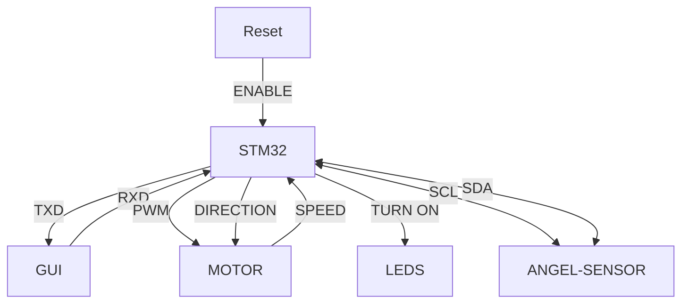

```
Author:     Mohammed Al-Heidous
Partner:    None
Date:       4-4-2022
Course:     ECE 5780, University of Utah, School of Computing
GitHub ID:  
Repo:       https://github.com/mba974/ECE-5780.git
Commit #:  
Project:   encoder motor control
Copyright:  ECE5780 and Mohammed Al-Heidous - This work may not be copied for use in Academic Coursework.
```

# Overview of the Final Mini Project
This project contain two language C & C#
<br/>
<br/>
C language: I have programmed the STM32F072RBTx to be able controlled encoder dc motor such as direction, speed of spain, angle degree and write & read USART.
<br/>
<br/>
C# language: I have created a GUI to be able controlled encoder dc motor such as direction, speed of spain, read angle degree and write & read USART and display stm32 device ID. 

# Time Expenditures:

1. Final Mini Project: Predicted Hours:35  Actual Hours: 4 weeks

# Devices:
1. STM32F072B-DISCO
2. L298N Motor Drive Controller Board DC H-Bridge
3. USB-UART (WITMOTION USB-UART 6-in-1 USB to Serial Converter)
4. AG966-07E: ASR012 I2C/PWM Smart TMR Angle Sensor breakout board
5. 12528: 8 mm Dia. x 8 mm Thick Diametrically-Magnetized Magnet	

# Flow Chart:


